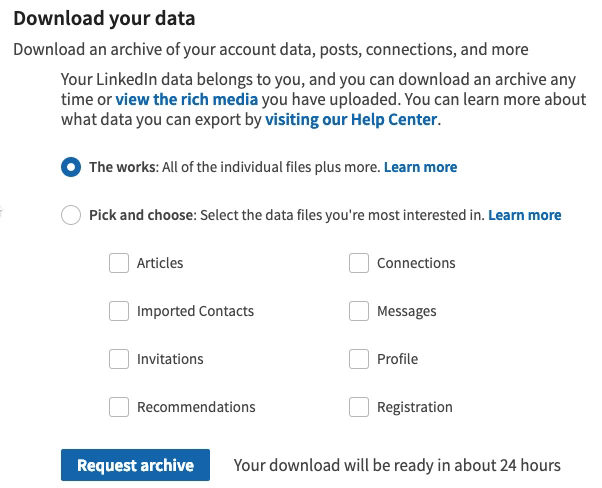
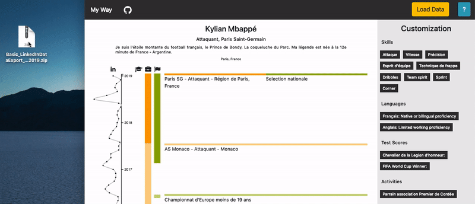
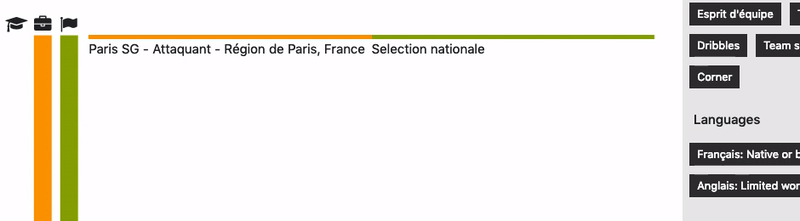

# vis-my_way

# Create your custom D3 resume !

Project [MyWay](https://guillaume-lesaine.github.io/vis-my_way/canva.html) wants to help you visualize your profesionnal career. We leverage D3.js to create a custom visual resume only based on the information stored on your LinkedIn profile page.

# Try it

You can first take a look at the platform [MyWay](https://guillaume-lesaine.github.io/vis-my_way/canva.html) and play with the default resume.

## 1. Load your LinkedIn archive

In order to properly use the platform, you need to download your full LinkedIn [personal archive](https://www.linkedin.com/psettings/member-data) enabled thanks to European Union GDPR. LinkedIn should send you to data under two versions, a light one after a few minutes and a complete one after 24h. The light data extraction is sufficient to use the platform. Once downloaded, unzip and load your directory data on the platform and you are all set!

## 2. Customize your resume

Once your LinkedIn data is loaded, you can use our functionalities to customize your resume and highlight your experiences. We provide two main customization features : modulate the details of your experiences and tag them with skills ! This can be done by clicking on the bars from the timeline and by using the drag and drop feature. Here is an exemple of that:

## 3. Export your resume

Once that you are satisfied with the result, you can clik on the PDF button and get your PDF resume.

# Additional information

We are hosted on GitHub. All the code that we use is in this repository, available for audit. Your data do not leave your computer, we use the capabilities of Javascript to run locally, on your browser.

# Credits

The work is original. Yet we used to following bricks for some functionalities :
 - Drag and Drop, core mecanism: [Open Classrooms](https://openclassrooms.com/fr/courses/1916641-dynamisez-vos-sites-web-avec-javascript/1922434-le-drag-drop)
 - Export, "html2canvas" module: [html2canvas](https://html2canvas.hertzen.com/) by Niklas Von Hertzen
 - Export, svg to canvas "canvg" module: [canvg](https://github.com/canvg/canvg)
 - Export, save to PDF "jsPDF" module: [jsPDF](https://github.com/MrRio/jsPDF)

### Authors : Guillaume Lesaine and Léo Peuziat
